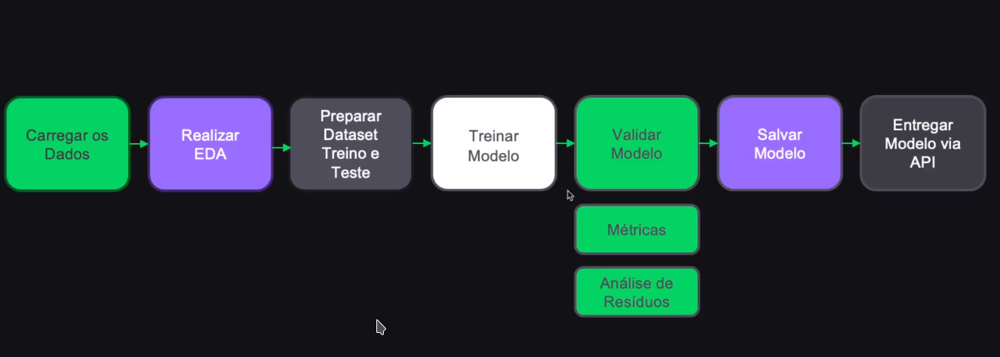

#### Run this model / Rode este modelo:
```bash
    uvicorn api_regression_model:app --reload
```

---

> PT-BR 🇧🇷
### 1. Análise de Regressão
Entender como uma variável dependente (target) está relacionada a uma ou mais variáveis independentes (fatores que acreditamos influenciar a variável dependente).

Ela permite contruir um modelo matemático, geralmente na forma de uma equação linear, que representa essa relação. Ao ajustar o model aos dados observados, podemos estimar os parâmetros e **entender como as mudanças nas variáveis independentes afetam a variável dependente**.

#### 1.1 Tipos de Regressão

### Explicação do Projeto
Uma plataforma online de educação, que consegue acompanhar a quantidade de horas que seus alunos passam estudando numa determinada trilha, deseja avaliar se esta quantidade de horas influencia na pontuação do teste final. Para isso, será treinado um algoritmo de regressão linear, de forma que seja possível prever a pontuação do teste final, dada a quantidade de horas de estudo.

#### Etapas de criação


#### Instale as dependencias
```bash
    # instalar as dependências do projeto
    pipenv install
```

### Conclusões
- [X] O modelo conseguiu prever bem? Sim, no universo dos dados que tínhamos.

---
> EN-US 🇺🇸
### 1. Regression Analysis (English)
Regression analysis aims to understand how a dependent variable (target) is related to one or more independent variables (factors believed to influence the dependent variable). It allows for building a mathematical model, usually in the form of a linear equation, representing this relationship. By fitting the model to the observed data, we can estimate the parameters and understand how changes in independent variables affect the dependent variable.

#### 1.1 Types of Regression

### Project Explanation
An online education platform, capable of tracking the number of hours its students spend studying on a particular learning path, wants to assess if this amount of study hours influences the final test score. For this purpose, a linear regression algorithm will be trained to predict the final test score given the number of study hours.

#### Steps To-Do


#### To Install
```bash
    # install project dependencies
    pipenv install
```

### Conclusions
- [X] Could the model predict well? Yes, in the dataset universe we had.